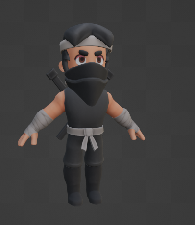

# **Takım İsmi**

Takım Unity 66

# Ürün İle İlgili Bilgiler

## Takım Elemanları

- Fulya Ateş: Developer / Scrum Master 
- Mahmut Sarıkaya: Developer 
- Şeref Şakacı: Developer
- Furkan Patlar: Developer
- Esra Şahin: Developer / Product Owner

## Ürün İsmi

Survival Legends

## Product Backlog URL

[Unity Team 66 Codecks Backlog Board](https://open.codecks.io/u66survivalegendsgeneral)

## Ürün Açıklaması

Dungeon/arena gibi bir alanda arkadaşlarımızla enemyleri tuzaklara takılmadan temizleyip bölüm bölüm kapı gibi alanlardan geçerek bölüm sonu daha güçlü  enemyler ile savaşıyoruz. 
Control: Joystick + Tab Skill Use
Camera: TPS

- **Oyunun birincil fonksiyonu**: Oyuncuların dungeon/arena gibi bir alanda arkadaşlarıyla birlikte enemyleri tuzaklara takılmadan temizlemek ve bölümleri geçmek olduğunu söyleyebiliriz. Oyuncular, joystick ve tab tuşunu kullanarak karakterlerini kontrol ederler ve tuzaklardan kaçınarak düşmanları yenmeye çalışırlar. Oyunun temel amacı, bölüm sonlarına ulaşmak ve daha güçlü düşmanlarla savaşmaktır.

- **Oyunun ikincil fonksiyonu**: Oyuncuların kaçıncı bölümde olduklarını görmelerini sağlamaktır. Bu, oyuncuların ilerleme kaydetmelerine ve oyunun zorluk seviyesinin artmasına olanak tanır. Böylece oyuncular, kendilerini meydan okuyucu düşmanlarla savaşırken sürekli olarak geliştirebilirler.

## Ürün Özellikleri
- Dungeon/Arena Ortamı: Oyunda, oyuncuların düşmanlarla savaşmak için dungeon veya arena gibi bir ortamda gezinmeleri gerekebilir.
- Bölüm Tabanlı İlerleme: Oyun, oyuncuların bölüm bölüm ilerleyerek daha zorlu düşmanlarla karşılaştığı bir ilerleme sistemi sunabilir.
- Güçlü Düşmanlar: Oyun ilerledikçe, oyuncular daha güçlü düşmanlarla karşılaşabilir ve onlarla savaşmak zorunda kalabilir.
- Karakter Kontrolü: Oyunda, oyuncuların karakterlerini bir joystick yardımıyla kontrol edebilecekleri bir kontrol mekanizması olabilir.
- Beceri Kullanımı: Oyunda, oyuncuların tab tuşu gibi belirli tuşlarla karakterlerinin yeteneklerini kullanabilecekleri bir beceri sistemi bulunabilir.
- Kamera Görünümü: Oyun, oyunculara üçüncü şahıs (TPS) kamera görünümü sunabilir.
- Tuzaklar: Oyunda, oyuncuların düşmanlardan kaçarken veya onları yenmeye çalışırken tuzaklara dikkat etmeleri gerekebilir.

## Hedef Kitle

Aksiyon ve macera seven oyuncular: Dungeon/arena ortamı, düşmanlarla savaşma, tuzaklardan kaçma ve zorlu bölümleri geçme gibi aksiyon ve macera unsurları içeriyor olabilir. Bu da aksiyon dolu oyunları seven oyuncuları hedefleyebilir.

Yetenek tabanlı oyunlardan hoşlanan oyuncular: Oyunun beceri kullanımı, tuzaklardan kaçma ve düşmanları yenme gibi yetenek gerektiren mekaniklere sahip olması, yetenek tabanlı oyunları seven oyuncuları hedefleyebilir.

## Juriye Not
Karakterleri Product Ownerımız kendisi yapmıştır. Oyunu bilgisayarda WASD ile oynayabilirisniz apk için joystick scriptimiz var ve test edildi. Multiplayer testleri başarılı olsada Sprint 2 bitiminden sonra zaman yetersizliği karşısında olası buglar sebebiyle eklenmemeye karar verilmiştir.

## Kullanılan Ücretsiz Assetler
https://kaylousberg.itch.io/kaykit-dungeon-remastered
https://kaylousberg.itch.io/kaykit-medieval-builder-pack
https://www.freepik.com/free-vector/hand-drawn-video-game-set-elements_40484561.htm#query=game%20UI&position=15&from_view=search&track=ais
https://www.freepik.com/free-vector/huge-set-fantasy-planets-dark-background_36102396.htm#query=set%20space%20game&position=8&from_view=search&track=ais
https://www.freepik.com/free-vector/icons-game-about-hiking-camping-tourism_27923153.htm#query=game-icons-with-heart&position=17&from_view=search&track=sph
https://assetstore.unity.com/packages/vfx/particles/cartoon-fx-remaster-free-109565
https://assetstore.unity.com/packages/vfx/particles/spells/magic-effects-free-247933
https://assetstore.unity.com/packages/vfx/particles/little-enchant-mesh-vfx-247587
https://assetstore.unity.com/packages/2d/textures-materials/sky/free-stylized-skybox-212257
Ücretsiz Sesler
https://freesound.org/people/MATRIXXX_/sounds/523763/
https://freesound.org/people/vox_artist/sounds/512160/ -Karakter öldüğünde kullanılmıştır ve archer karakterinde ise Unityde bulunan pitch özelliğiyle ses tizleştirilmiştir.
https://freesound.org/people/dkiller2204/sounds/422966/
https://freesound.org/people/robbeman/sounds/495643/
https://freesound.org/people/thecrow_br/sounds/574044/
https://freesound.org/people/kdemani/sounds/635328/
https://freesound.org/people/iscence/sounds/647702/
https://freesound.org/people/mywhats/sounds/175520/
https://freesound.org/people/MAbdurrahman/sounds/459116/
https://freesound.org/people/malatestinic.com/sounds/481583/
https://freesound.org/people/Fupicat/sounds/538149/
background müziği ücretsiz loop birleştirilerek ücretsiz olarak soundtrap.com ile yapılmıştır https://www.soundtrap.com/signup?ref=45d1120e2687c7edf9afaeeed7d09328

---

# Sprint 1

- **Sprint içinde tamamlanması tahmin edilen puan**: 100 Puan
- **Puan tamamlama mantığı**: Toplamda proje boyunca tamamlanması gereken 340 puanlık backlog bulunmaktadır. 3 sprint'e bölündüğünde ilk sprint'in en azından 100 ile başlaması gerektiğine karar verildi.
- **Daily Scrum**: Daily Scrum toplantılarının zamansal sebeplerden ötürü Whatsapp üzerinden yapılmasına karar verilmiştir. Daily Scrum toplantısı örneği jpeg veya word olarak Readme'de tarafımızdan paylaşılmaktadır: [Sprint 1 Daily Scrum Chats](SurvivalLegends/Assets/ProjectManagement/Sprint1Documents/DailyScrumMeetingNotesSprint1.docx)
- **Sprint Notları**: User Story'ler product backlog'ların  kartlarına atanmıştır.  Product backlog kartlarına tıklandığında hikayelerin detayları okunabilir.
- **Sprint board update**: Sprint board screenshotları: 

 

- **Ürün Durumu**: Ekran görüntüleri:

   
   
  
  
  
  
- **Sprint Review**: 
 Alınan kararlar: Oyun için görevler gözden geçirilmiş, Kullanıcı kontrolleri ve multiplayer kontrol edilmiştir. Sprint Review katılımcıları: Esra , Şeref , Furkan, Mahmut, Fulya

- **Sprint Retrospective:**
Takım üyeleri ile süreci ve iş akışını nasıl geliştirebilecekleri hakkında toplantılar yapıldı.
Takımca sprint boyunca verimliliği artırmak için kullanabilecekleri araçlar veya teknikler hakkında konuşuldu.
Takım, gelecek sprintler için gerçekçi hedefler belirlemek için birlikte toplantılar yapıldı.

 

---

## Product Backlog URL

[Unity Team 66 Codecks Backlog Board](https://open.codecks.io/u66survivalegends)
---

# Sprint 2
- **Sprint içinde tamamlanması tahmin edilen puan**: 130 Puan
- **Puan tamamlama mantığı**: Toplamda proje boyunca tamamlanması gereken 340 puanlık backlog bulunmaktadır. 3 sprint'e bölündüğünde ikinci sprint'in 130 ile başlaması gerektiğine karar verildi.
- **Daily Scrum**: Daily Scrum toplantılarının zamansal sebeplerden ötürü Whatsapp ve Discord üzerinden yapılmasına karar verilmiştir. Daily Scrum toplantısı örneği jpeg veya word olarak Readme'de tarafımızdan paylaşılmaktadır: [Sprint 2 Daily Scrum Chats](SurvivalLegends/Assets/ProjectManagement/Sprint2Documents/DailyScrumMeetingNotesSprint2.docx) 
- **Sprint Notları**: User Story'ler product backlog'ların  kartlarına atanmıştır.  Product backlog kartlarına tıklandığında hikayelerin detayları okunabilir. Product backloglar product owner ile birlikte oluşturulmuştur.
- **Sprint board update**: Sprint board screenshotları:
 
  
  
  
  
  

- **Ürün Durumu**: Ekran görüntüleri:

  
  
  
  
  
  
  
  
  
  
  
- **Sprint Review**: 
 Alınan kararlar: Takım, sprint başlangıcında belirlenen hedefleri değerlendirdi. Hangi görevlerin başarılı olduğunu, hangilerinin zorluklarla karşılaşıldığını ve nedenlerini tartışıldı. Sprint Review katılımcıları: Esra , Şeref , Furkan, Mahmut, Fulya

- **Sprint Retrospective:**
Her bir takım üyesi, sprint süreci hakkında kendi görüşlerini ve deneyimlerini paylaştılar.
Takım üyeleri, sprint boyunca başarılı olan şeyleri paylaşıldı ve bunların neden iyi çalıştığını analiz ettiler.
Sprint sırasında takımın karşılaştığı engelleri ve zorlukları tartışıldı.

---

## Product Backlog URL

[Unity Team 66 Codecks Backlog Board](https://open.codecks.io/u66survivalegendsprint2)
---

# Sprint 3

- **Sprint içinde tamamlanması tahmin edilen puan**: 110
- **Puan tamamlama mantığı**: Toplamda proje boyunca tamamlanması gereken 340 puanlık backlog bulunmaktadır. 3 sprint'e bölündüğünde ikinci sprint'in 130 ile başlaması gerektiğine karar verildi.
- **Daily Scrum**: Daily Scrum toplantılarının zamansal sebeplerden ötürü Whatsapp ve Discord üzerinden yapılmasına karar verilmiştir. Daily Scrum toplantısı örneği jpeg veya word olarak Readme'de tarafımızdan paylaşılmaktadır: [Sprint 3 Daily Scrum Chats](SurvivalLegends/Assets/ProjectManagement/Sprint3Documents/DailyScrumMeetingNotesSprint3.docx)  
- **Sprint Notları**: User Story'ler product backlog'ların  kartlarına atanmıştır.  Product backlog kartlarına tıklandığında hikayelerin detayları okunabilir. Product backloglar product owner ile birlikte oluşturulmuştur.

- **Sprint board update**: Sprint board screenshotları:

  
  
  
  
  
  
  
  
  
  

- **Ürün Durumu**: Ekran görüntüleri:

  
  
  
  
  

- **Sprint Review**:  Alınan kararlar: Takım, oyun teslim süresine göre neleri yetiştirebilirizi konuştuk. Multiplayer'ın yetişemeyeceği düşünülerek zaten test aşamasında olan multiplayerı oyunumuza katmamaya karar verdik. Sprint Review katılımcıları: Esra , Şeref , Furkan, Mahmut, Fulya

- **Sprint Retrospective:**
-Takım üyeleri ürün teslim tarihine kadar neleri yetiştirebiliriz diye toplatılar yaptı. Zamana ve çıkan sorunlara göre hedefte bitmesi gereken bazı özellikler oyundan çıkarılmaya karar verildi.
-Takım üyeleri Sprint boyunca öğrendikleri olumlu ve olumsuz deneyimleri paylaştı. Bu deneyimleri "Olumlu Öğrenmeler" ve "Geliştirilmesi Gereken Alanlar" şeklinde kategorilere ayırarak, gelecek sprintlerdeki gelişim fırsatlarını belirledik.
-Takım üyeleri Sprint sürecinde birbirlerine olan takdirlerini paylaştı. 

---

## Product Backlog URL

[Unity Team 66 Codecks Backlog Board](https://open.codecks.io/sp3)
---
