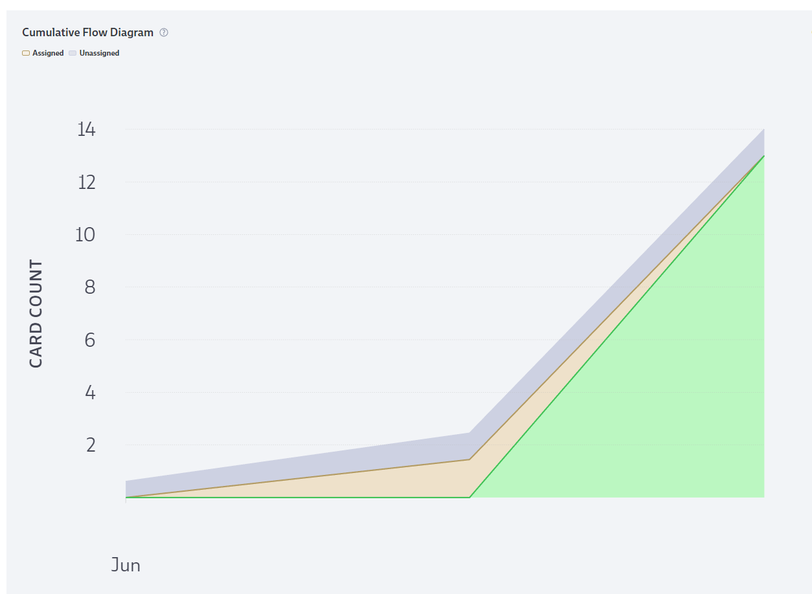

# **Takım İsmi**

Takım Unity 66

# Ürün İle İlgili Bilgiler

## Takım Elemanları

- Fulya Ateş: Developer / Scrum Master 
- Mahmut Sarıkaya: Developer 
- Şeref Şakacı: Developer
- Furkan Patlar: Developer
- Esra Şahin: Developer / Product Owner

## Ürün İsmi

Survival Legends

## Product Backlog URL

[Unity Team 66 Codecks Backlog Board](https://open.codecks.io/u66survivalegends)

## Ürün Açıklaması

Multiplayer olarak dungeon/arena gibi bir alanda arkadaşlarımızla enemyleri tuzaklara takılmadan temizleyip bölüm bölüm kapı gibi alanlardan geçerek bölüm sonu daha güçlü  enemyler ile savaşıyoruz. Oyun sonu  kaçıncı olduğumuzu görüyoruz.
Control: Joystick + Tab Skill Use
Camera: TPS

- **Oyunun birincil fonksiyonu**: Oyuncuların multiplayer olarak dungeon/arena gibi bir alanda arkadaşlarıyla birlikte enemyleri tuzaklara takılmadan temizlemek ve bölümleri geçmek olduğunu söyleyebiliriz. Oyuncular, joystick ve tab tuşunu kullanarak karakterlerini kontrol ederler ve tuzaklardan kaçınarak düşmanları yenmeye çalışırlar. Oyunun temel amacı, bölüm sonlarına ulaşmak ve daha güçlü düşmanlarla savaşmaktır.

- **Oyunun ikincil fonksiyonu**: Oyuncuların kaçıncı bölümde olduklarını görmelerini sağlamaktır. Bu, oyuncuların ilerleme kaydetmelerine ve oyunun zorluk seviyesinin artmasına olanak tanır. Böylece oyuncular, kendilerini meydan okuyucu düşmanlarla savaşırken sürekli olarak geliştirebilirler.

## Ürün Özellikleri
- Multiplayer Modu: Arkadaşlarınızla veya diğer oyuncularla online olarak oynama imkanı sağlayan bir çok oyunculu mod.
- Dungeon/Arena Ortamı: Oyunda, oyuncuların düşmanlarla savaşmak için dungeon veya arena gibi bir ortamda gezinmeleri gerekebilir.
- Bölüm Tabanlı İlerleme: Oyun, oyuncuların bölüm bölüm ilerleyerek daha zorlu düşmanlarla karşılaştığı bir ilerleme sistemi sunabilir.
- Güçlü Düşmanlar: Oyun ilerledikçe, oyuncular daha güçlü düşmanlarla karşılaşabilir ve onlarla savaşmak zorunda kalabilir.
- Karakter Kontrolü: Oyunda, oyuncuların karakterlerini bir joystick yardımıyla kontrol edebilecekleri bir kontrol mekanizması olabilir.
- Beceri Kullanımı: Oyunda, oyuncuların tab tuşu gibi belirli tuşlarla karakterlerinin yeteneklerini kullanabilecekleri bir beceri sistemi bulunabilir.
- Kamera Görünümü: Oyun, oyunculara üçüncü şahıs (TPS) kamera görünümü sunabilir.
- Tuzaklar: Oyunda, oyuncuların düşmanlardan kaçarken veya onları yenmeye çalışırken tuzaklara dikkat etmeleri gerekebilir.

## Hedef Kitle

Çok oyunculu deneyimi seven oyuncular: Oyunun multiplayer modu ve arkadaşlarla birlikte oynama özelliği, çok oyunculu deneyimi seven oyuncuları hedefleyebilir. Bu, oyuncuların birlikte oynayarak eğlenmelerini ve takım çalışması becerilerini kullanmalarını sağlar.

Aksiyon ve macera seven oyuncular: Dungeon/arena ortamı, düşmanlarla savaşma, tuzaklardan kaçma ve zorlu bölümleri geçme gibi aksiyon ve macera unsurları içeriyor olabilir. Bu da aksiyon dolu oyunları seven oyuncuları hedefleyebilir.

Rekabetçi oyuncular: Oyunun ilerleme kaydetme ve daha zorlu düşmanlarla karşılaşma mekanikleri, rekabetçi oyuncuları cezbetebilir. Kendi ilerlemelerini takip etmek ve diğer oyuncularla yarışmak isteyen oyuncular, bu tarz oyunlardan keyif alabilir.

Yetenek tabanlı oyunlardan hoşlanan oyuncular: Oyunun beceri kullanımı, tuzaklardan kaçma ve düşmanları yenme gibi yetenek gerektiren mekaniklere sahip olması, yetenek tabanlı oyunları seven oyuncuları hedefleyebilir.

## Juriye Not

---

# Sprint 1

- **Sprint içinde tamamlanması tahmin edilen puan**: 100 Puan

- **Puan tamamlama mantığı**: Toplamda proje boyunca tamamlanması gereken 340 puanlık backlog bulunmaktadır. 3 sprint'e bölündüğünde ilk sprint'in en azından 100 ile başlaması gerektiğine karar verildi.

- **Daily Scrum**: Daily Scrum toplantılarının zamansal sebeplerden ötürü Whatsapp üzerinden yapılmasına karar verilmiştir. Daily Scrum toplantısı örneği jpeg veya word olarak Readme'de tarafımızdan paylaşılmaktadır: [Sprint 1 Daily Scrum Chats](SurvivalLegends/Assets/ProjectManagement/Sprint1Documents/DailyScrumMeetingNotesSprint1.docx)
- **Sprint Notları**: User Story'ler product backlog'ların  kartlarına atanmıştır.  Product backlog kartlarına tıklandığında hikayelerin detayları okunabilir.
- **Sprint board update**: Sprint board screenshotları: 

 

- **Ürün Durumu**: Ekran görüntüleri:

   
   
  
  
  
  
- **Sprint Review**: 
 Alınan kararlar: Oyun için görevler gözden geçirilmiş, Kullanıcı kontrolleri ve multiplayer kontrol edilmiştir. Sprint Review katılımcıları: Esra , Şeref , Furkan, Mahmut, Fulya

- **Sprint Retrospective:**
Takım üyeleri ile süreci ve iş akışını nasıl geliştirebilecekleri hakkında toplantılar yapıldı.
Takımca sprint boyunca verimliliği artırmak için kullanabilecekleri araçlar veya teknikler hakkında konuşuldu.
Takım, gelecek sprintler için gerçekçi hedefler belirlemek için birlikte toplantılar yapıldı.

 

---

## Product Backlog URL

[Unity Team 66 Codecks Backlog Board](https://open.codecks.io/u66survivalegends)
---

# Sprint 2

- **Sprint içinde tamamlanması tahmin edilen puan**: 

- **Daily Scrum**: Daily Scrum toplantılarının zamansal sebeplerden ötürü Whatsapp üzerinden yapılmasına karar verilmiştir. Daily Scrum toplantısı örneği jpeg veya word olarak Readme'de tarafımızdan paylaşılmaktadır: [Sprint 2 Daily Scrum Chats]()

- **Sprint board update**: Sprint board screenshotları: 
-

- **Ürün Durumu**: Ekran görüntüleri:
- **Sprint Review**: 

- **Sprint Retrospective:**

  -

---

## Product Backlog URL

---

# Sprint 3

- **Sprint içinde tamamlanması tahmin edilen puan**: 

- **Daily Scrum**: Daily Scrum toplantılarının zamansal sebeplerden ötürü Whatsapp üzerinden yapılmasına karar verilmiştir. Daily Scrum toplantısı örneği jpeg veya word olarak Readme'de tarafımızdan paylaşılmaktadır: [Sprint 3 Daily Scrum Chats](

- **Sprint board update**: Sprint board screenshotları: 

- **Ürün Durumu**: Ekran görüntüleri:

- **Sprint Review**: 

- **Sprint Retrospective:**

---
